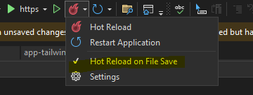

## TailwindLive for .NET Web Apps in VS 2022

Make sure you have **git bash**, **npm**, and **node** installed on your local machine. Hot reload also needs to be enabled in VS2022. Works with RazorPages and Blazor Server .NET 8

To help refreshing, also install the following extension for autosaving [AutoSaveFile](https://marketplace.visualstudio.com/items?itemName=HRai.AutoSaveFile). 3 seconds for the save setting seems to work great.

**Install TailwindCSS:**
 -   Open a terminal (e.g., Command Prompt, PowerShell, or terminal in Visual Studio).
 -   Navigate to your project directory.
 -   Initialize npm to create a `package.json` file:

    npm init -y 
    
 -   Install TailwindCSS and its dependencies:

    npm install -D tailwindcss postcss autoprefixer 
    
 -   Generate TailwindCSS configuration files:

    npx tailwindcss init -p 
    
 -   This creates `tailwind.config.js` and `postcss.config.js` files.

**Configure TailwindCSS:**

 -   Edit the `tailwind.config.js` file:

            module.exports = { 
                content: ["./**/*.{html,cshtml,razor,js}"], 
                theme: { 
                    extend: {}, 
                }, 
                plugins: [], 
            }
 -   Create a `css` folder in the `wwwroot` directory.
 -   Inside the `css` folder, create a `tailwind.css` file and replace with the following content:

            @tailwind base; 
            @tailwind components; 
            @tailwind utilities;
- Inside the `css` folder, create a `app-tailwind.css` blank file.

 - Add these scripts to your `package.json` to build and watch TailwindCSS

            "scripts": {
                "build:css": "tailwindcss build -i ./wwwroot/css/tailwind.css -o ./wwwroot/css/app-tailwind.css",
                "watch:css": "tailwindcss -i ./wwwroot/css/tailwind.css -o ./wwwroot/css/app-tailwind.css --watch"
            }, 
## Implement Middleware
Install TailwindLive from nuget.

- Add the following line to your Home.razor or Index.cshtml files:

`
This is Tailwind CSS
`
- For Razor Pages add the following in the head element /Pages/Shared/Layout.cshtml

        <link href="~/css/app-tailwind.css" rel="stylesheet" />
- For Blazor add the following in the head element /Components/App.razor

        <link href="/css/app-tailwind.css" rel="stylesheet" />

- Then add the following to your Program.cs

        if (app.Environment.IsDevelopment())
        {
            app.UseGitBashMiddleware(new MiddlewareOptions
            {
                GitBashExe = "c:\\path\\to\\git-bash.exe",
                WorkingDirectory = Environment.CurrentDirectory,
                NpmBuildArguments = "-c \"npm run build:css\"", //Change these if you named your scripts differently
                NpmWatchArguments = "-c \"npm run watch:css\""
            });
        }

### Build and run!
- Press control-f5 or f5 to begin the debugger.
- The build command will run and close out the window.
- Once complete the watch command will run and it will monitor the files and update the console as it reloads.
- You should see the elements change as they are saved and reloaded. If you use a utility class that hasn't been used it may take a second for Tailwind to pull it into the css file. If it doesn't seem to be updating control-f5 and it will restart a fresh build. 
